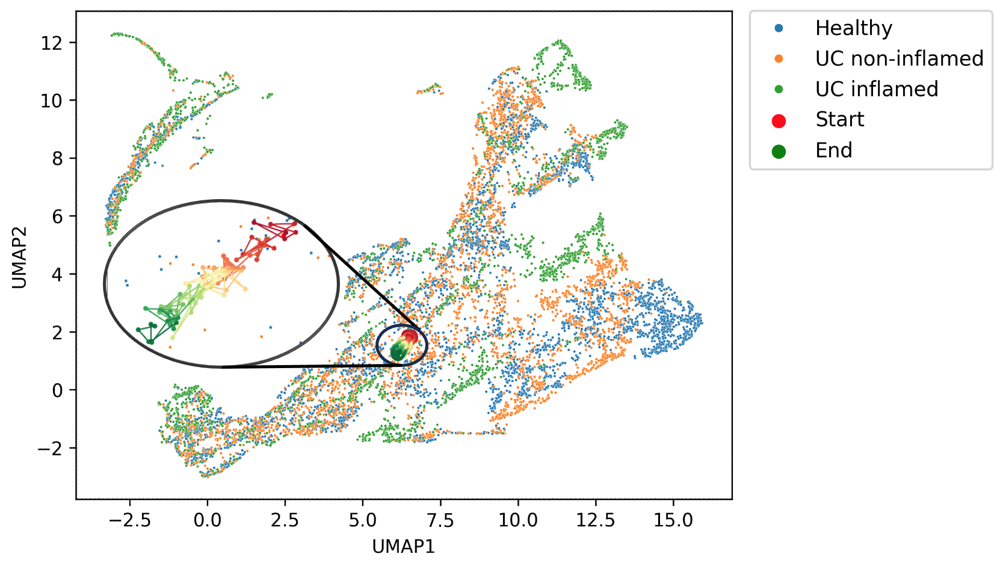
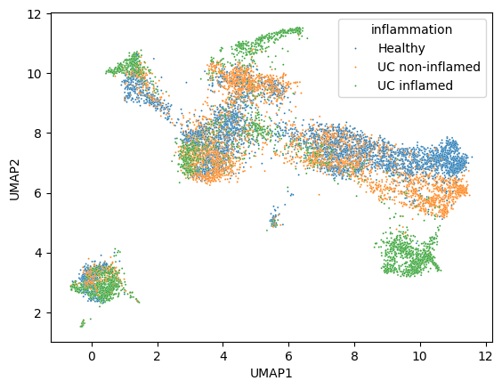
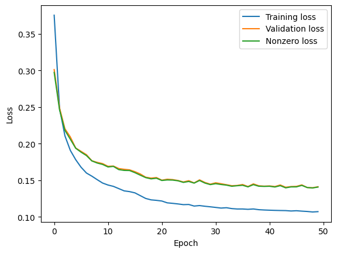

# Virtual cell line

The goal of this project is to create a virtual model capable of predicting the gene expression profile of a given cell in response to some perturbation.
The vision of a workflow is as follows:
1. Pick a cell.
2. Introduce a perturbation = change the expression level of a gene.
3. Predict the gene expression profile of the cell in response to the perturbation.

If the perturbation is introduced gradually, the model should predict the "trajectory" of the cell in the gene expression space.
The figure below illustrates this idea.

## Data
Currently, the model is trained on 11k single-cell RNA-seq samples from 9 biopsies from human colon (3 healthy, 3 ulcerative colitis - inflamed, 3 ulcerative colitis - uninflamed).
The umap of the original samples is shown below.

## Model architecture
The architecture of the model is a masked autoencoder (bottleneck size 1024).
Each sample is fed to the model with between 50 and 80% of the non-zero genes masked out (set to 0).
The model is trained to predict the original levels of gene expression of the masked genes.
I'm masking only the non-zero genes because the zero values are ambiguous - they are either missing values or truly zero values and there's no way to distinguish between them.

The model is trained to minimize the mean squared error between the original and the predicted gene expression levels.
80% of the samples are used for training and the remaining 20% for validation.
For now I ran the training for 50 epochs with a batch size of 32 samples.
The learning rate is set to 0.001.
The plot below shows the loss of the model on the training and validation sets.

The final loss on the validation set is 0.14, which is not great, but at least it's better than the baseline model (predicting the mean expression level of each gene), which is 0.30.

## Roadmap
1. Finish and deploy the app that will allow to play with the model.
2. Move the training to the cloud.
3. Train the model on more data.
4. Improve the model architecture.